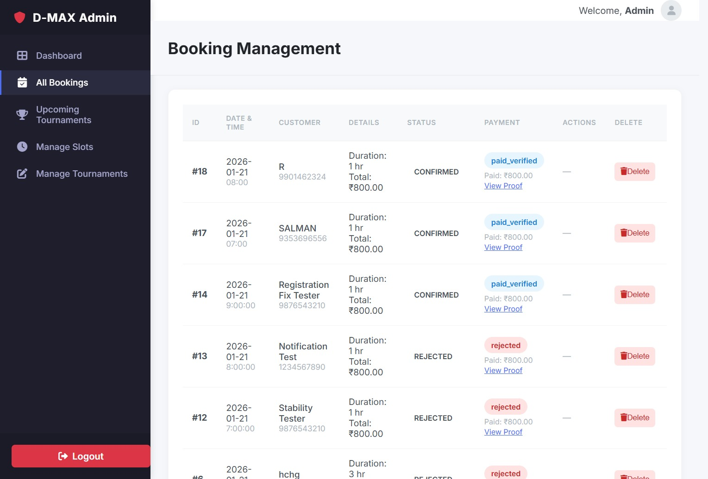
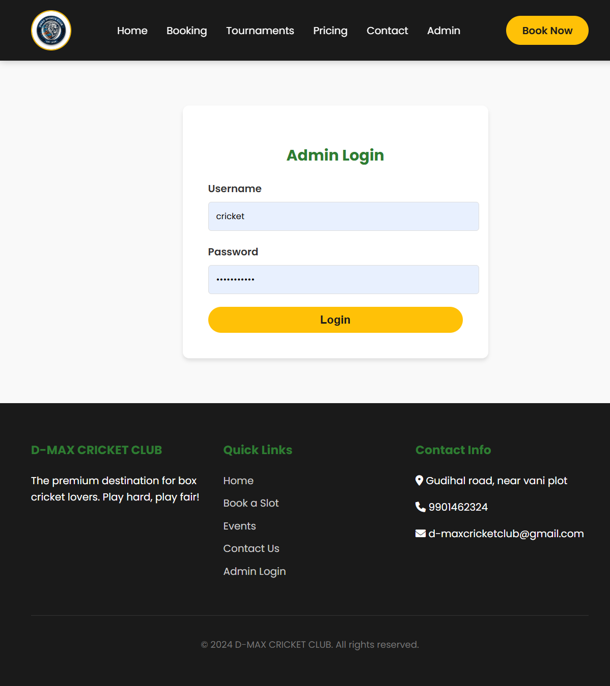
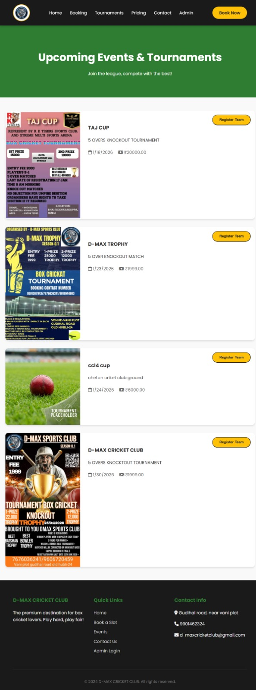
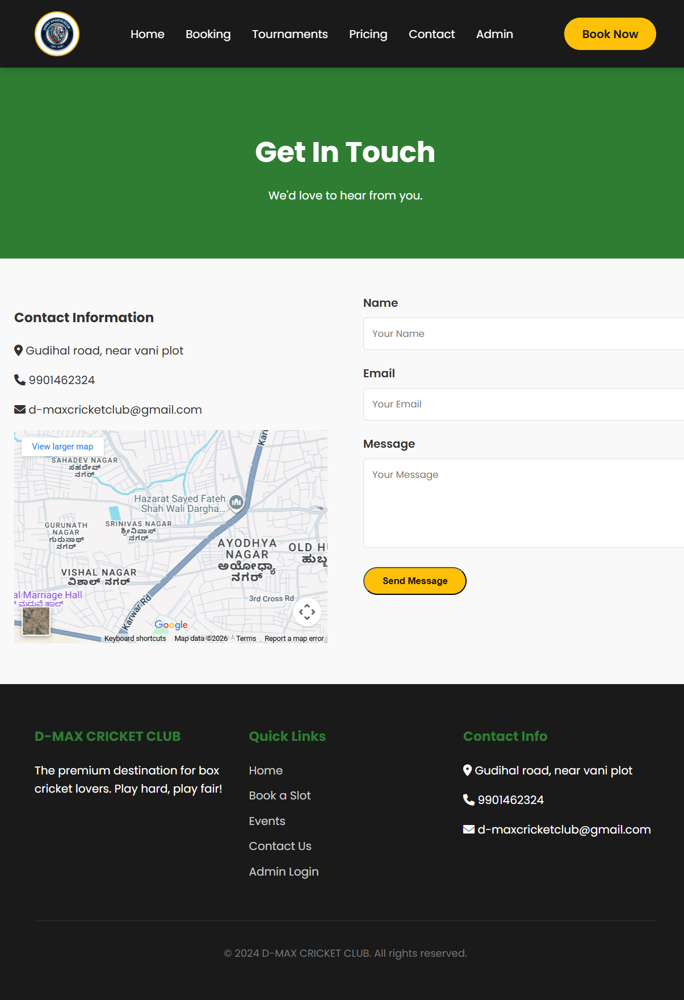

# 🏏 D-MAX Cricket Club Booking System

A full-stack web application for managing box cricket slot bookings, tournaments, and admin operations. Built with **Flask** and **MySQL**, featuring a responsive UI and secure payment verification workflow.

## 🚀 Features

### 👤 User Features
- **Slot Booking**: View available slots and book time for box cricket.
- **Dynamic Pricing**: Automatic price calculation based on duration and weekend rates.
- **Payment Integration**: Upload payment screenshots (UPI/QR) for verification.
- **Tournaments**: View upcoming tournaments and register teams.
- **Responsive Design**: Works seamlessly on mobile and desktop.
- **Notifications**: Email and WhatsApp confirmations for bookings context.

### 🛡️ Admin Dashboard
- **Booking Management**: Approve, reject, or delete bookings.
- **Payment Verification**: View uploaded payment screenshots side-by-side with booking details.
- **Slot Management**: Add, delete, or toggle availability of time slots.
- **Tournament Management**: Create and manage tournaments (dates, fees, images).
- **Secure Login**: Protected admin area.

## 🛠️ Tech Stack
- **Frontend**: HTML5, CSS3, JavaScript (Vanilla)
- **Backend**: Python (Flask)
- **Database**: MySQL
- **Services**: Twilio (WhatsApp), SMTP (Email)

## ⚙️ Installation & Setup

1.  **Clone the repository**
    ```bash
    git clone https://github.com/mdrizwankotwal7860/D-MAX-CRICKET-CLUB.git
    cd D-MAX-CRICKET-CLUB
    ```

2.  **Create a Virtual Environment**
    ```bash
    python -m venv .venv
    # Windows
    .venv\Scripts\activate
    # Mac/Linux
    source .venv/bin/activate
    ```

3.  **Install Dependencies**
    ```bash
    pip install -r requirements.txt
    ```

4.  **Configure Environment Variables**
    Create a `.env` file in the root directory and add your credentials:
    ```ini
    MAIL_USERNAME=your_email@gmail.com
    MAIL_PASSWORD=your_app_password
    TWILIO_SID=your_twilio_sid
    TWILIO_AUTH_TOKEN=your_twilio_auth_token
    TWILIO_WHATSAPP_NUM=whatsapp:+14155238886
    ADMIN_PHONE=whatsapp:+91xxxxxxxxxx
    ```

5.  **Database Setup**
    - Import `schema.sql` into your MySQL database or run the schema initialization scripts found in the repository.
    - Update `config.py` with your MySQL credentials if different from default.

6.  **Run the Application**
    ```bash
    python app.py
    ```
    Access the app at `http://127.0.0.1:5000`.

## 📸 Screenshots
### Home Page


### Booking Page


### Admin Dashboard


### Admin Login


### Tournaments Page


### Contact Page


## 🤝 Contributing
Contributions are welcome! Please feel free to submit a Pull Request.
